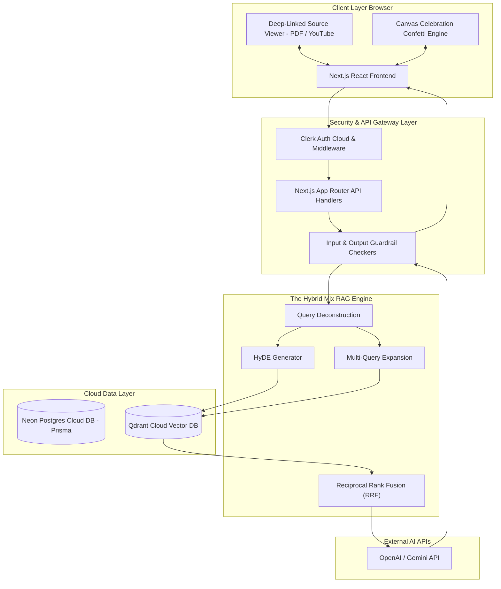

# Technical Design Document: SynthMind (HLD & LLD)

**Author:** Senior Technical Architect & Product Engineering Team  
**System:** SynthMind - AI-Powered Grounded Research Assistant  
**Stack:** Next.js (App Router), Clerk Auth, Neon Serverless Postgres (Prisma ORM), Qdrant Cloud Vector DB, OpenAI / Gemini APIs, Vercel  

---

## 1. High-Level Design (HLD)

### 1.1 System Architecture Overview

The system follows a production-grade, asynchronous serverless architecture. Heavy document ingestion tasks (PDF extraction, YouTube caption parsing with oEmbed title resolution, vector embedding, and Qdrant upserts) are decoupled from HTTP API routes using an **Async Background Task Queue** with exponential backoff retries. Retrieval uses **The Hybrid Mix RAG Engine** combining Query Deconstruction, HyDE, Multi-Query, and Reciprocal Rank Fusion (RRF).



---

### 1.2 Core Subsystem Boundaries

#### 1. Auth & Identity Subsystem (Clerk Cloud & Modular Middleware)
- Manages user identity, OAuth providers (Google/GitHub), JWT session tokens, and path-matched route protection via `middleware.ts`.
- Every incoming API handler delegates authorization to `authorizeNotebookAccess` (`src/lib/auth-helpers.ts`) to enforce strict tenant isolation boundaries across database and vector queries.

#### 2. Multi-Source Ingestion & Binary Storage Subsystem
- Responsible for fetching, extracting, and normalizing content from 5 input types:
  1. **PDF Files:** Extracted via `pdf-parse` retaining page numbers.
  2. **Plain Text / MD:** Directly normalized.
  3. **Web URLs:** Scraped using `cheerio` + HTML text sanitization.
  4. **YouTube Videos:** Fetches video metadata + original video title via oEmbed API (`youtube.com/oembed`) + timestamped transcript captions (`start`, `duration`).
  5. **VTT / Transcript Files:** Regex parsing of WebVTT format capturing timestamps (`00:01:20 --> 00:01:45`).
- Maintains ingestion lifecycle states in Neon DB: `pending` ➔ `indexing` ➔ `ready` | `error`.
- Dual Binary Storage: Generates 15-minute expiring AWS S3 presigned URLs when AWS S3 is enabled, with automatic local disk storage fallback (`./uploads/sources/`) for local offline environments.

#### 3. Vector Indexing Subsystem (Qdrant Cloud)
- Chunks raw text into overlapping windows (600 tokens, 100 overlap).
- Generates 1536-dimensional embeddings using OpenAI `text-embedding-3-small`.
- Upserts vectors into Qdrant Cloud collection `notebook_chunks` with rich payload tags:
  `{ notebook_id, source_id, source_type, text, page_number, start_time }`.

#### 4. The Hybrid Mix RAG & Citation Engine
- **Query Deconstruction:** Splits compound user queries into single-intent sub-questions.
- **HyDE & Multi-Query Expansion:** Generates 3 semantic variations + a hypothetical document excerpt to bridge layman-to-jargon vocabulary gaps.
- **Reciprocal Rank Fusion (RRF):** Scores and fuses retrieved candidate chunk lists ($K=60$).
- **Streaming & Citations:** Streams tokens with numerical citation badges `[1]`, `[2]`.

#### 5. Dual-Voice Audio Podcast Subsystem & Length Selector
- **Synthesizer API (`/api/audio-overview`):** Accepts `length` parameter (`short`, `medium`, `long`).
- Dynamically configures LLM turn length instructions (4-6 turns for `short`, 8-10 for `medium`, 12-16 for `long`).

#### 6. 3D Flashcards & Confetti Celebration Engine (`src/lib/confetti.ts`)
- Zero-dependency canvas confetti rendering engine.
- Triggers particle explosion physics when user masters 100% of a flashcard deck or completes 100% of a study plan roadmap.

---

## 2. Low-Level Design (LLD)

### 2.1 Database Schema (Prisma ORM for Neon Postgres)

```prisma
model Notebook {
  id          String   @id @default(uuid())
  userId      String   // Clerk User ID
  title       String
  description String?
  createdAt   DateTime @default(now())
  updatedAt   DateTime @updatedAt

  sources     Source[]
  notes       Note[]
  studyPlans  StudyPlan[]
}

model Source {
  id           String   @id @default(uuid())
  notebookId   String
  notebook     Notebook @relation(fields: [notebookId], references: [id], onDelete: Cascade)
  title        String
  type         String   // "pdf" | "text" | "url" | "youtube" | "vtt"
  urlOrPath    String?
  status       String   @default("pending") // "pending" | "indexing" | "ready" | "error"
  errorMessage String?
  content      String?  @db.Text
  createdAt    DateTime @default(now())
}
```
