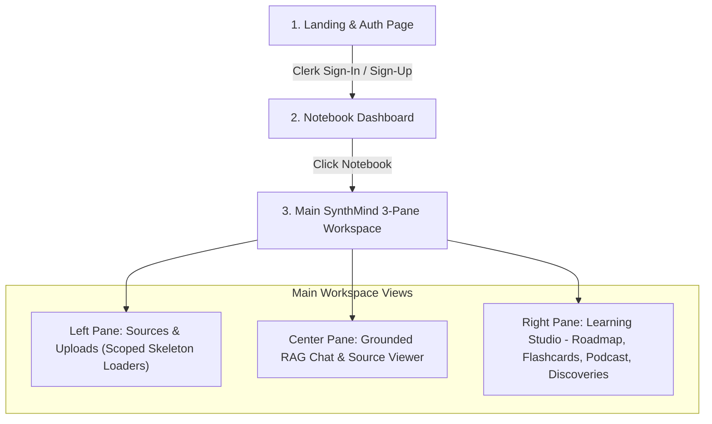

# UI Prototype Design & Walkthrough: SynthMind

**Brand Name:** SynthMind  
**Tagline:** *"Synthesize any source into instant understanding."*  
**Visual Theme:** Midnight Obsidian & Electric Emerald (Dark Glassmorphic UI)

---

## 1. Application Navigation & Screen Hierarchy



---

## 2. Screen Breakdown & Visual Wireframes

### Screen 1: Notebook Dashboard (Multi-Notebook Manager)

```
+-------------------------------------------------------------------------------------------------------+
|  ⚡ SynthMind AI                                            [Search Notebooks...]  (User Avatar) [Logout]|
+-------------------------------------------------------------------------------------------------------+
|                                                                                                       |
|  MY NOTEBOOKS (3)                                                                [+ New Notebook]     |
|                                                                                                       |
|  +--------------------------------+  +--------------------------------+  +-------------------------+  |
|  | 📚 System Design Mastery       |  | 🔬 AI & ML Research Papers     |  | 💼 Q3 Competitor Brief  |  |
|  | Created: 2 hours ago           |  | Created: Yesterday             |  | Created: 3 days ago     |  |
|  | Sources: 4 (PDF, YT, Web)      |  | Sources: 2 (PDFs)              |  | Sources: 1 (Web URL)    |  |
|  | [Open Notebook]   [...]        |  | [Open Notebook]   [...]        |  | [Open Notebook]   [...] |  |
|  +--------------------------------+  +--------------------------------+  +-------------------------+  |
|                                                                                                       |
+-------------------------------------------------------------------------------------------------------+
```

---

## Screen 2: Main SynthMind Workspace (3-Pane Layout with 3D Flashcards & Podcast Toolbar)

```
+-----------------------------------------------------------------------------------------------------------------------+
|  [⚡ SynthMind] | [Dropdown: System Design Mastery v]  [+ New Notebook]        [User: alex@example.com] [Logout]      |
+-----------------------------------------------------------------------------------------------------------------------+
| SOURCES (Left Pane: 25%)      | CHAT & STUDIO (Center Pane: 50%)                | LEARNING STUDIO (Right Pane: 25%)   |
|-------------------------------|-------------------------------------------------|-------------------------------------|
| [+ Add Source]                | Active Sources: (3 Enabled)                     | [ Tabs: Roadmap | Flashcards | Podcast ]|
|                               | ----------------------------------------------- |                                     |
| [x] 📄 System_Design_Ch1.pdf  | AI Chat:                                        | SERIAL STUDY PLAN ROADMAP:          |
|     └ Status: [ Ready ]       | User: Generate interactive flashcards           | [x] Step 1: System Basics           |
|                               |                                                 | [ ] Step 2: Caching Deep Dive       |
| [x] 🎥 YouTube: Distributed   | 🎴 3D INTERACTIVE FLASHCARDS:                   |   ├ 📄 PDF: Ch1.pdf (Page 14)       |
|     └ Status: [ Ready ]       | Front: What is Write-Through caching?           |   └ 🎥 YT: Cache_Video @ 04:15     |
|                               | Back: Writes to cache & DB synchronously [1]    |  🎉 [Curriculum Fully Completed!]   |
| [x] 🌐 Redis_Guide_Article    | Citation: [1] (Click opens SourceViewer)        | ----------------------------------  |
|     └ Status: [ Ready ]       | 🎉 [Deck Mastered! Confetti Burst!]            | AUDIO PODCAST OVERVIEW:             |
|                               | ----------------------------------------------- | Length: [Short] [Medium] [Detailed] |
| [ ] 📝 Raw_Lecture_Notes.txt  | [ Type a message or query sources... ] (Enter)  | [>] Generate Podcast                |
|     └ Status: [ Ready ]       |                                                 | Host A: "Welcome to today's deep..."|
|                               | =============================================== | Host B: "Thanks Alex! So first..."  |
| --- Source Details ---        | SOURCE VIEWER DEEP-LINK (Citation [1] Click):   | ----------------------------------  |
| 4 Sources Ingested            | [YouTube Embedded Player: Distributed_Cache_YT] | PROACTIVE DISCOVERIES:              |
| 1,240 Vector Chunks Indexed   |  [ > Playing at 04:15 - "LRU vs LFU"]            | [!] 2 Contradictions Found          |
+-----------------------------------------------------------------------------------------------------------------------+
```
